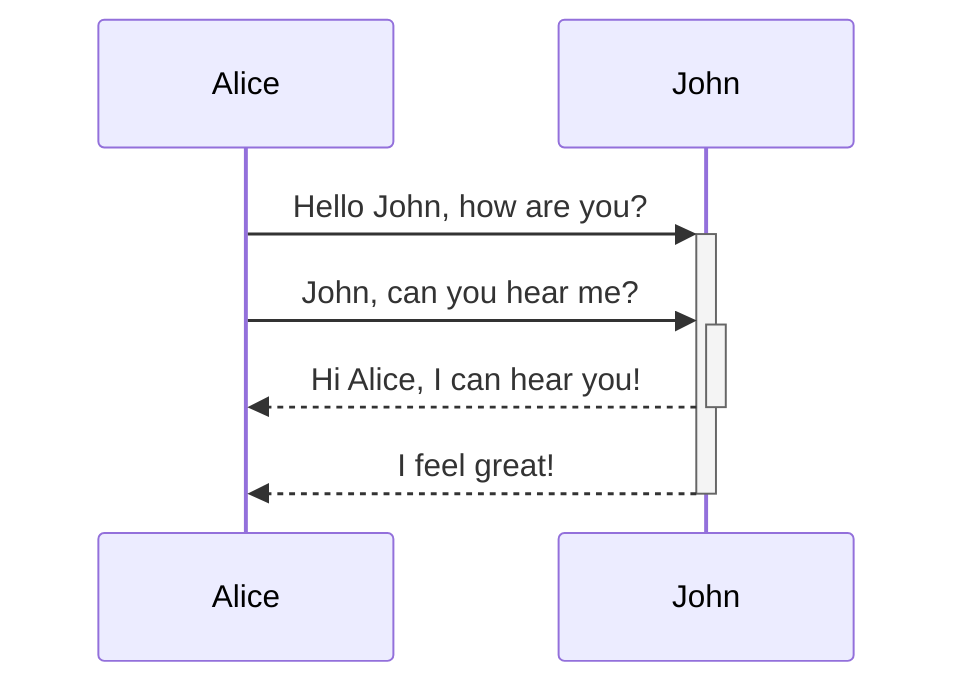

# Opsconf

## Comment tester ?

Lancer les tests auto : 

```
$ ./tests/run_tests.sh
```

## Comment utiliser sans installer?

```bash
export PATH=$PATH:<repo_opsconf>/src/bin
export OPSCONF_DIR=$<repo_opsconf>/src/share
```

Se placer le repo à gérer en conf et commencer à travailler.
<div class="right">


</div>

