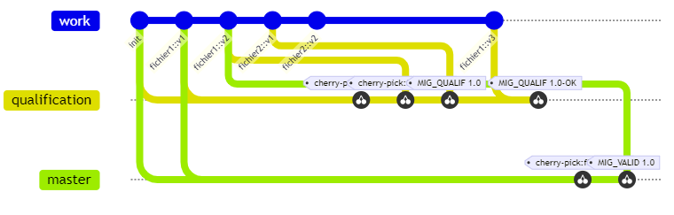

# Opsconf

Un outil de gestion de configuration pour les données opérationnelles.

[[_TOC_]]

## Comment tester ?

Lancer les tests auto : 

```
$ ./tests/run_tests.sh
```

## Comment utiliser sans installer?

```bash
export PATH=$PATH:<repo_opsconf>/src/bin
export OPSCONF_DIR=$<repo_opsconf>/src/share
```

Se placer le dépôt à gérer en conf et commencer à travailler.

## Utilisation

 1. Initialisation du dépôt:
    ```bash
    $ opsconf init
    ```
 2. Création d'un fichier, puis création de la première version
    ```bash
    $ mkdir MIG/MIG1/FCP/DHS/
    $ vi MIG/MIG1/FCP/DHS/DHS_TEST_CONNECTION.fcp
    # .... Edition de la FCP
    $ opsconf commit MIG/MIG1/FCP/DHS/DHS_TEST_CONNECTION.fcp
    # un éditeur s'ouvre pour indiquer le message de commit
    [INFO] File commited: "MIG/MIG1/FCP/DHS/DHS_TEST_CONNECTION.fcp"
    ```

 3. Modification d'un fichier et création d'une nouvelle version
    ```bash
    $ vi MIG/MIG1/FCP/DHS/DHS_TEST_CONNECTION.fcp
    # .... Edition de la FCP
    $ opsconf commit -m "PULP_FT-1232 Ajoute la fonction demandée" MIG/MIG1/FCP/DHS/DHS_TEST_CONNECTION.fcp
    [INFO] File commited: "MIG/MIG1/FCP/DHS/DHS_TEST_CONNECTION.fcp"
    ``` 
    **Remarque:** plusieurs fichiers peuvent être commités en même temps en ajoutant l'option `-r` à la commande `opsconf commit`.

 4. Rollback d'une version précédente
    ```bash
    $ opsconf rollback -m "PULP_FT-1232 La version 2 ne convient pas" MIG/MIG1/FCP/DHS/DHS_TEST_CONNECTION.fcp
    ``` 

 5. Mise en qualification de la v1 d'un fichier
    ```bash
    $ opsconf checkout qualification
    $ opsconf qualify MIG/MIG1/FCP/DHS/DHS_TEST_CONNECTION.fcp v1
    [INFO] Retrieved changes of MIG/MIG1/FCP/DHS/DHS_TEST_CONNECTION.fcp
    v1: <message de la v1>
    ```
 6. Mise en production de la v3 d'un fichier
    ```bash
    $ opsconf checkout master
    $ opsconf validate MIG/MIG1/FCP/DHS/DHS_TEST_CONNECTION.fcp v3
    [INFO] Retrieved changes of MIG/MIG1/FCP/DHS/DHS_TEST_CONNECTION.fcp
    v1: <message de la v1>
    v2: <message de la v2>
    v3: <message de la v3>
    ```
## Architecture

### Dépendences

Les dépendances suivantes doivent être installées sur la machine en question
 * bash
 * git

### Description de l'architecture

`Opsconf` est développé en bash. Il pourrait être envisagé de le porter en python dans le futur, mais cela nécessiterait d'ajouter GitPython dans ses dépendances.

Il repose sur `git` via des surcouches et des hooks, permettant d'assurer le fonctionnement attendu par les utilisateur, c'est à dire la gestion de version de fichiers unitairement.

`Opsconf` est composé :
 * d'un exécutable `opsconf` (déployé dans `$PREFIX/bin/`)
 * d'une librarie `libopsconf` (déployée dans `$PREFIX/share/opsconf/libs/`)
 * d'un ensemble de scripts, appelés par l'exécutable principal (déployés dans `$PREFIX/share/opsconf/`)
 * de hooks (déployés dans `$PREFIX/share/opesconf/githooks`). Ces hooks seront copiés dans le dossier local au dépôt `$GITDIR/.git/hooks/`, lors de l'appel à la commande `opsconf init`.

Les traitements git structurants permettant la gestion de configuration sont traités via les hooks afin que, si quelqu'un utilise directement git, la gestion de configuration ne soit pas mise en péril. L'exécutable et les scripts permettent de masquer la complexité de git et de fournir une interface utilisateur plus confortable.

Ainsi les hooks ont pour fonction: 
 * de s'assurer qu'un commit ne porte que sur un unique fichier
 * de renommer le commit de façon à ce qu'il porte un numéro de version (v1, v2, v3...)
 * de s'assurer avant et après le commit que le dépôt local est synchronisé avec le dépôt central.

### Exemple


Le scénario ci-dessus est le suivant:
* On initalise le dépôt (`opsconf init`).
* On crée 2 versions du fichier "fichier1" (`opsconf commit`).
* On crée 2 versions du fichier "fichier2" (`opsconf commit`).
* On lance un essai pour qualifier les fichiers "fichier1" (en v2) et "fichier2" (en v1) (`opsconf qualify`). On taggue cet état (`opsconf tag`).
* Il y a un bug sur "fichier1", on revient dans work et on crée une 3e version du fichier "fichier1", qu'on ramène ensuite en qualif (`opsconf commit` + `opsconf qualify`).
* La validation c'est bien passée. On taggue (`opsconf tag`). 
* Suite à analyse, on déduit que le fichier "fichier2" n'est pas valide.
* On récupère l'état de ce tag (sauf "fichier2" qui est considéré comme non valide") et on le passe comme validé sur la branche master (`opsconf validate`).

